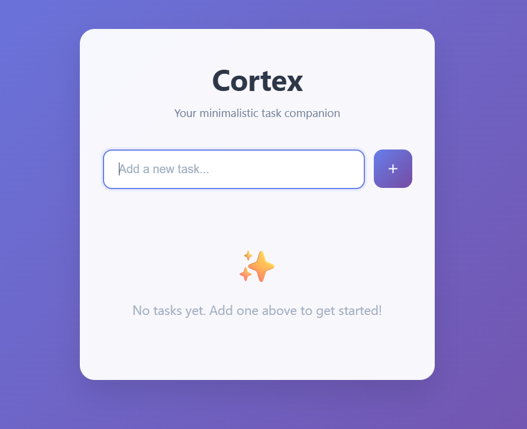
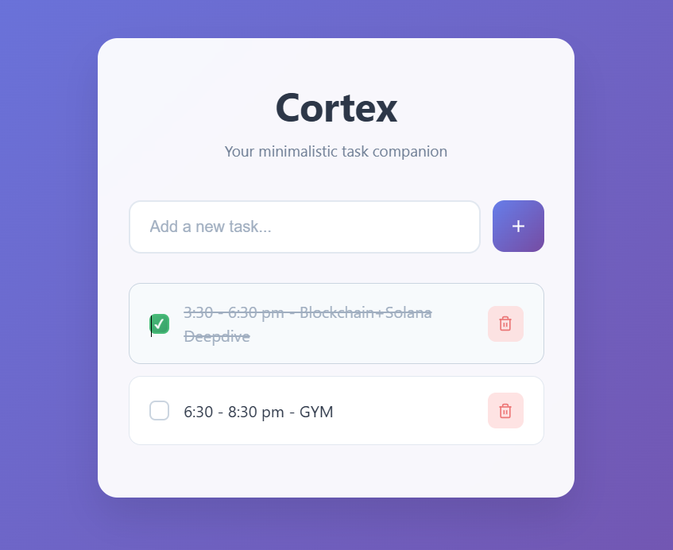

# ✨ Cortex – Your Minimalistic Task Companion

**Cortex** is a sleek, no-nonsense to-do app designed to help you stay organized and focused. Built with vanilla HTML, CSS, and JavaScript — no frameworks, just simplicity.

> 🧠 "Clear tasks. Clear mind."

---

## 🌐 Live Demo

🔗 [Try Cortex Live](https://cryosleeperX20.github.io/Cortex)

---

## 🛠️ Features

- 📋 Add new tasks instantly  
- ✅ Mark tasks as completed  
- 🗑️ Delete tasks easily  
- 💾 Stores your tasks in local storage  
- 🎨 Beautiful and minimal UI

---

## 📸 Screenshots

| Add Task View | Task Completed View |
|---------------|---------------------|
|  |  |


---

## 🧰 Tech Stack

- **HTML**
- **CSS**
- **JavaScript (Vanilla)**

---

## 📂 File Structure

```bash
Cortex/
├── screenshots
├── index.html       # HTML structure
├── style.css        # Styles and animations
├── script.js        # Core functionality
